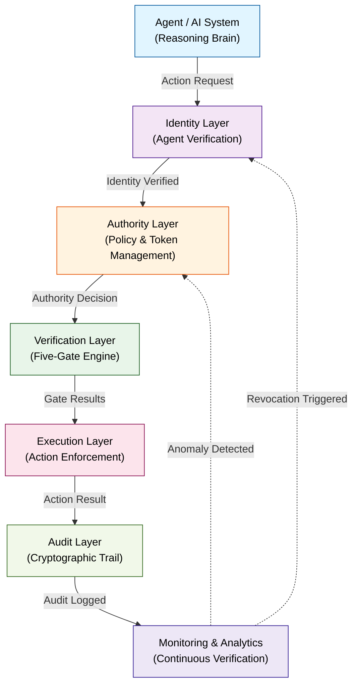

# Figure 1: Overall IrisKey Architecture

## Description
The five-layer architecture of the IrisKey trust system, showing the flow from agent identity through to verified audit trail.

## System Diagram (Mermaid)

## Detailed Component Breakdown

### Layer 1: Identity Layer
- **Function:** Verify agent identity and credentials
- **Components:**
  - Agent Registry (lookup and validation)
  - Credential Verification (signature validation)
  - Revocation List Checking
  - Certificate Chain Validation
- **Output:** Identity Token (valid/invalid/revoked)

### Layer 2: Authority Layer
- **Function:** Determine if authorization policy permits action
- **Components:**
  - Policy Repository (active policies)
  - Role/Capability Mapping (agent authorizations)
  - Scope Definition (action and resource scopes)
  - Authority Token Generation
- **Output:** Authority Decision (approved/denied/escalated)

### Layer 3: Verification Layer
- **Function:** Apply Five-Gate authorization engine
- **Components:**
  - Identity Gate (agent authenticity)
  - Policy Gate (policy compliance)
  - Action Gate (scope validation)
  - Context Gate (anomaly detection)
  - Execution Gate (resource readiness)
- **Output:** Gate Decisions (all-pass approval required)

### Layer 4: Execution Layer
- **Function:** Enforce approved actions and monitor execution
- **Components:**
  - Action Executor (perform authorized action)
  - Execution Monitor (watch for drift)
  - Resource Accessor (enforce scoped access)
  - Real-time Logging (action-time audit capture)
- **Output:** Action Result (success/failure with details)

### Layer 5: Audit Layer
- **Function:** Create tamper-evident, cryptographic audit trail
- **Components:**
  - Audit Entry Creator (signed records)
  - Hash Chain Maintainer (sequential integrity)
  - Merkle Tree Builder (aggregate proofs)
  - Audit Store (immutable record)
- **Output:** Cryptographically Signed Audit Entry

### Monitoring & Analytics (Cross-Layer)
- **Function:** Continuous verification and anomaly detection
- **Components:**
  - Behavioral Profiling (understand normal patterns)
  - Anomaly Scoring (detect deviations)
  - Alert Generation (escalation triggers)
  - Continuous Review (ongoing authorization assessment)
- **Feedback:** Triggers revocation or policy update

## Data Flow

1. **Action Initiation:** Agent formulates action request
2. **Identity Verification:** Agent identity verified; credentials checked
3. **Authority Evaluation:** Policy and scope constraints evaluated
4. **Gate Verification:** Sequential Five-Gate authorization
5. **Execution:** If approved, action executed with monitoring
6. **Audit Recording:** Complete decision path cryptographically signed
7. **Continuous Assessment:** Monitoring detects anomalies; can trigger revocation

## Key Principles

- **Layered Defense:** Each layer is independent; compromise of one doesn't bypass others
- **Separation of Concerns:** Each layer has focused responsibility
- **Deterministic:** No learning or probabilistic decisions in authorization layers (predictable)
- **Auditable:** Every decision recorded; full replay capability
- **Real-Time Verification:** Not deferred; happens before and during action
- **Revocable:** Authority can be immediately revoked; revocation takes effect within SLA

## Caption

**Figure 1: Overall IrisKey Architecture.** Five-layer trust system architecture showing agent identity verification (Layer 1), authority policy evaluation (Layer 2), Five-Gate verification (Layer 3), execution enforcement (Layer 4), and cryptographic audit trail (Layer 5). Continuous monitoring (cross-layer) triggers revocation or policy updates based on anomaly detection.
