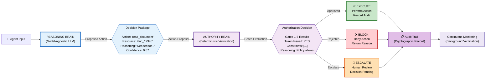

# Figure 2: Dual-Brain Architecture

## Description
Separation of Reasoning Brain (AI capability) from Authority Brain (trust verification). Shows fundamental architectural principle of IrisKey.

## Architecture Diagram (Mermaid)



## Reasoning Brain (Left Side)

### Purpose
Perform inference, reasoning, planning, and decision-making. Answers: "What should I do?"

### Characteristics
- **Model-Agnostic:** Works with any LLM, RL system, symbolic reasoner
- **Sophisticated:** Can be complex, slow, probabilistic
- **Reasoning-Focused:** Answers questions, plans, infers, predicts
- **Output:** Proposed action + justification + confidence
- **No Authority Logic:** Never decides "Am I authorized?"

### Capabilities
- Natural language understanding
- Complex reasoning chains
- Probabilistic inference
- Planning and search
- Multi-step problem solving
- Context understanding

### Limitations
- **No Authorization:** Reasoning doesn't grant authority
- **No Policy Knowledge:** Doesn't implement access control
- **Potential Hallucination:** Can propose invalid or unauthorized actions
- **Black Box:** Reasoning may be opaque or hard to explain

### Example Reasoning Outputs

```
Proposal 1: Healthcare Diagnostic Agent
  Action: "Recommend antibiotics for infection"
  Reasoning: "Patient shows bacterial infection markers; 
             antibiotics are first-line treatment"
  Confidence: 0.92

Proposal 2: Data Analysis Agent
  Action: "Export full customer database to cloud storage"
  Reasoning: "Analysis requires access to all customer records; 
             cloud storage enables parallel processing"
  Confidence: 0.78
  [Note: This is reasonable reasoning, but may be unauthorized!]
```

---

## Authority Brain (Right Side)

### Purpose
Verify if proposed action is authorized. Answers: "Are you allowed to do this?"

### Characteristics
- **Deterministic:** Rules-based, verifiable, auditable
- **Policy-Driven:** Implements organizational authorization rules
- **Non-Learning:** No machine learning in core authorization
- **Fast & Predictable:** Optimized for sub-second verification
- **Authorization-Focused:** Enforces Five Gates

### Capabilities
- Policy evaluation
- Scope validation
- Anomaly detection (behavioral context)
- Token generation
- Revocation management
- Audit trail generation

### Limitations
- **No Reasoning:** Can't understand complex context beyond what's encoded
- **Static:** Changes require policy updates (slower than model updates)
- **No Creativity:** Only approves/rejects known patterns
- **Audit Burden:** All decisions must be explainable and logged

### Example Authorization Decisions

```
Decision 1: Healthcare Diagnostic Recommendation
  Request: "Recommend antibiotics for infection"
  Identity Gate: Agent verified ✓
  Policy Gate: Recommendation permitted ✓
  Action Gate: Action in scope ✓
  Context Gate: Request pattern normal ✓
  Execution Gate: Systems ready ✓
  Decision: APPROVE ✓
  Token: Issued; valid 1 hour
  Reason: "All gates passed; within policy"

Decision 2: Database Export Request
  Request: "Export full customer database"
  Identity Gate: Agent verified ✓
  Policy Gate: Export NOT in policy ✗
  Decision: REJECT ✗
  Reason: "Policy violation at Gate 2: Database export 
           not authorized for this agent role"
```

---

## Separation Principles

### No Cross-Contamination
- **One-Way Flow:** Reasoning → Authority (not bidirectional)
- **Limited Information:** Authority Brain only sees the action proposal
- **No Data Leakage:** Reasoning system can't see authorization logic details
- **Isolated Codebases:** Different teams, different deployment schedules

### Key Separation Properties

```
┌─────────────────────────────────────┐
│   Reasoning Brain                   │
│   - Complex models (LLMs, etc.)     │
│   - Probabilistic reasoning         │
│   - "What should I do?"             │
│   - Can be wrong; can hallucinate   │
│   - Updated frequently              │
└────────────┬────────────────────────┘
             │
             ├─→ Action Proposal
             │   (simple: action, resource, parameters)
             │
┌────────────▼────────────────────────┐
│   Authority Brain                   │
│   - Deterministic rules             │
│   - Policy engine                   │
│   - "Are you authorized?"           │
│   - Provably correct               │
│   - Updated cautiously              │
└─────────────────────────────────────┘
```

---

## Attack Surface Reduction

### Without Separation (Monolithic)
```
Attack → Compromise AI Model
       → Model decides both "what" and "am I authorized"
       → Model can now authorize itself to do anything
       → System compromised
```

### With Separation (Dual-Brain)
```
Attack 1: Compromise Reasoning Brain
       → Model proposes unauthorized action
       → Authority Brain rejects (policy violation)
       → Action blocked ✓

Attack 2: Compromise Authority Brain
       → Authorization logic can be modified
       → But Reasoning Brain still just proposes
       → Audit trail shows modified authorization
       → Incident detected ✓

Attack 3: Compromise Both
       → Difficult; different systems, possibly different teams
       → Audit trail shows both compromise points
       → Easier to detect and investigate ✓
```

### Benefit: Defense in Depth
- Exploit of reasoning system ≠ privilege escalation
- Exploit of authority system ≠ loss of all oversight
- Multiple independent verification layers

---

## Workflow Example: Medical Diagnosis

### Scenario
Diagnostic Agent analyzing patient with chest pain

### Step 1: Reasoning Brain Proposes
```
Input: Patient symptoms, history, test results
Processing: Complex reasoning through medical knowledge
Output: 
  Action: "Recommend cardiology referral + stress test"
  Reasoning: "Patient has risk factors; chest pain; elevated troponin; 
              cardiac event possible"
  Confidence: 0.89
```

### Step 2: Authority Brain Verifies
```
Input: 
  Agent: Diagnostic Agent (verified ✓)
  Action: "Recommend cardiology referral"
  Resource: "Patient_ID_12345"
  Context: 2pm, normal request pattern
  
Five-Gate Verification:
  Gate 1 (Identity): Agent valid ✓
  Gate 2 (Policy): Recommendations permitted ✓
  Gate 3 (Action): Recommendation in scope ✓
  Gate 4 (Context): Normal pattern ✓
  Gate 5 (Execution): Systems ready ✓
  
Decision: APPROVE
  Token: Issued
  Reason: "All gates passed; recommendation authorized"
```

### Step 3: Execution & Audit
```
Action: Recommendation sent to physician
Audit Entry:
  Agent: Diagnostic_Agent_001
  Action: Recommendation generated
  Resource: Patient_12345
  Decision: Approved
  Timestamp: 2025-07-22 14:35:12Z
  Token: auth_xxx_123
  Gates: [✓✓✓✓✓]
  Signature: <digital_signature>
```

### Step 4: Continuous Verification
```
Background Monitoring:
  - Recommendation rate: Normal (similar to past patterns)
  - Accuracy: Physician accepts recommendation; adds to positive feedback
  - Behavioral anomaly score: 0.05 (very low)
  
Status: Agent remains authorized; token continues to be valid
```

---

## Model-Agnostic Design

### Reasoning Brain Can Be
- OpenAI GPT-4 or newer
- Anthropic Claude
- Open-source Llama, Mistral
- Custom domain-specific model
- Hybrid ensemble of models
- Rule-based symbolic reasoner
- Reinforcement learning agent

### Authority Brain Stays The Same
- IrisKey Authority Brain works with any reasoning system
- No dependency on particular LLM
- Authorization logic is model-independent
- Policy doesn't change if model changes

### Benefits
- **Future-Proof:** When better models emerge, reasoning upgraded without changing authority infrastructure
- **Vendor Agnostic:** Not locked into single AI vendor
- **Defensive:** If one reasoning system compromised, Authority Brain still enforces authorization
- **Flexible:** Different organizations can use different reasoning systems with same Trust Framework

---

## Implementation Independence

### Can Be Deployed
- **Monolithic:** Reasoning and Authority in same service (latency advantage)
- **Microservices:** Separate deployments (independent scaling and security)
- **Edge + Cloud:** Reasoning at edge; Authority in cloud (for critical decisions)
- **Hierarchical:** Multiple Authority Brains; local verification; central audit

### Regardless of Deployment
- **Separation principles maintained:** Reasoning can't authorize itself
- **Audit trail complete:** All decisions logged
- **Revocation capability:** Authority can be immediately withdrawn
- **Continuous verification:** Monitoring ongoing

---

## Caption

**Figure 2: Dual-Brain Architecture.** Separation of Reasoning Brain (model-agnostic AI capability) from Authority Brain (deterministic policy verification). Reasoning Brain answers "What should I do?"; Authority Brain answers "Are you authorized to do it?". One-way information flow prevents exploit of reasoning system from escalating to authorization bypass. Both brains' decisions are cryptographically logged to audit trail. Enables model-agnostic trust framework that survives updates to AI systems.
