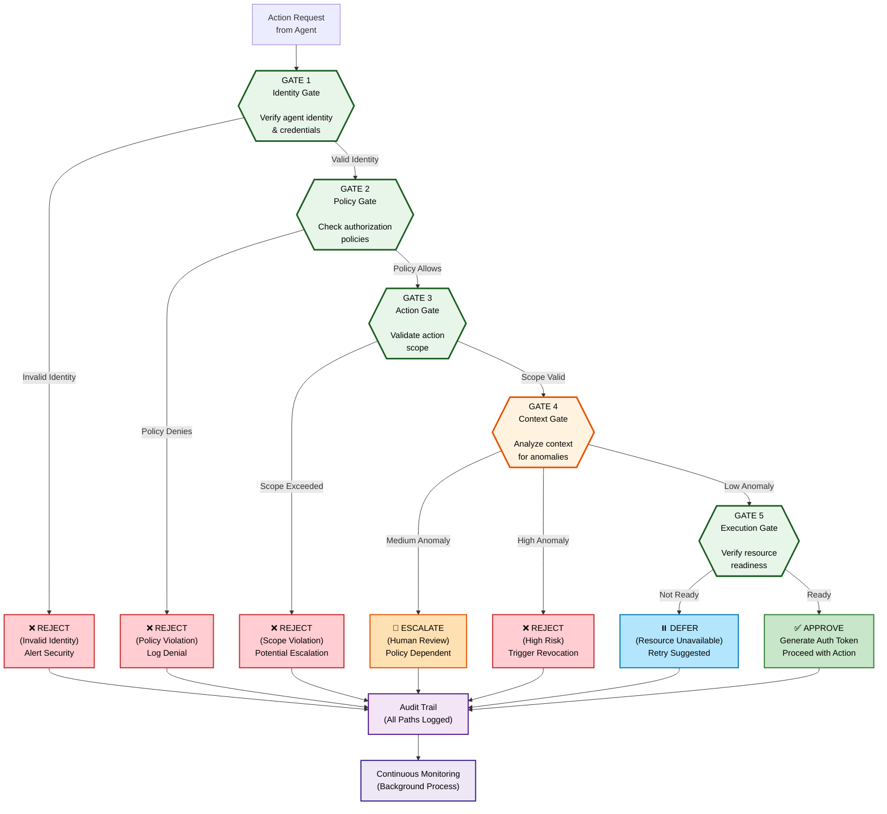

# Figure 5: Five-Gate Authorization Workflow

## Description
The sequential authorization gates that an action request must pass through. All gates must pass for action approval.

## Workflow Diagram (Mermaid)



## Gate-by-Gate Breakdown

### GATE 1: Identity Gate
**Question:** Is this request from a valid agent with verified identity?

**Verification Process:**
1. Extract agent identity from request
2. Validate cryptographic signature
3. Check agent certificate
4. Consult revocation list
5. Validate chain of custody

**Failure Mode:** Immediate rejection; alert security team  
**Success Output:** Identity verified token; agent metadata  
**Latency:** ~1–5 ms (fast cryptographic operations)

**Example Pass:**
```
Request: Agent_Diagnostic_001 requests "analyze_patient_data"
Verification:
  - Signature valid? YES ✓
  - Certificate current? YES ✓
  - In revocation list? NO ✓
  - Chain of custody valid? YES ✓
Result: Identity verified; proceed to Gate 2
```

**Example Failure:**
```
Request: Unknown agent_id="agent_xyz_999" requests access
Verification:
  - Signature valid? NO ✗
Result: REJECT (Invalid Identity); Log security alert
```

---

### GATE 2: Policy Gate
**Question:** Do current authorization policies permit this action?

**Verification Process:**
1. Retrieve active policies from policy repository
2. Evaluate policy rules (deterministic logic)
3. Check role/capability matching
4. Verify time-based constraints (time windows, rate limits)
5. Apply policy decision logic

**Failure Mode:** Rejection; log policy violation  
**Success Output:** Policy verdict (allowed); policy ID  
**Latency:** ~10–50 ms (policy evaluation)

**Example Pass:**
```
Agent: Diagnostic Agent
Action: "analyze_patient_data"
Policy Evaluation:
  - Policy "diagnostic_analysis_v2" active? YES ✓
  - Agent role "diagnostician" in policy? YES ✓
  - Time window (business hours)? YES ✓
  - Rate limit (10 analyses/hour)? 6 current; OK ✓
Result: Policy allows; proceed to Gate 3
```

**Example Failure:**
```
Agent: General Purpose Agent
Action: "delete_audit_logs"
Policy Evaluation:
  - Policy "log_deletion" allows this agent? NO ✗
  - Only admins permitted (agent is not admin)
Result: REJECT (Policy Violation); Log attempted access
```

---

### GATE 3: Action Gate
**Question:** Is the specific action within the agent's authorized scope?

**Verification Process:**
1. Verify action is in agent's action scope
2. Verify resource being accessed is in scope
3. Verify action parameters are within acceptable ranges
4. Enforce resource-level access control
5. Prevent scope escalation (can't access resources outside scope)

**Failure Mode:** Rejection; log scope violation  
**Success Output:** Action validated; scope confirmation  
**Latency:** ~5–20 ms (scope checking)

**Example Pass:**
```
Agent: Healthcare Agent
Action: "read_patient_history"
Resource: "Patient_ID_12345"
Scope Validation:
  - Action "read_patient_history" in scope? YES ✓
  - Resource is patient (not admin data)? YES ✓
  - Parameters valid (date range reasonable)? YES ✓
  - Cross-tenant access? NO ✓ (same org)
Result: Action scope valid; proceed to Gate 4
```

**Example Failure:**
```
Agent: Billing Agent
Action: "update_patient_prescriptions"
Scope Validation:
  - Action "update_prescriptions" in agent's scope? NO ✗
  - Billing agent can: read_invoices, update_payments only
Result: REJECT (Scope Violation); escalate potential privilege escalation attempt
```

---

### GATE 4: Context Gate
**Question:** Does the request context show signs of compromise or anomaly?

**Verification Process:**
1. Behavioral anomaly detection (is this typical for agent?)
2. Temporal pattern analysis (time of day; frequency)
3. Environmental signals (source IP, device, network conditions)
4. Context consistency (do parameters align with typical usage?)
5. Cross-agent patterns (is this coordinated with other suspicious requests?)

**Anomaly Scoring:** 0–1 scale
- 0.0–0.3: Low risk (proceed)
- 0.3–0.7: Medium risk (escalate per policy)
- 0.7–1.0: High risk (reject; revoke token)

**Failure Mode:** Escalation or rejection depending on anomaly score  
**Success Output:** Risk assessment; anomaly flags  
**Latency:** ~50–500 ms (analysis intensive; can be async)

**Example Pass:**
```
Agent: Diagnostic Agent
Action: "analyze_patient_data"
Context Analysis:
  - Time pattern: 2pm (normal for this agent) ✓
  - Request frequency: 5/hour (typical 2–8/hour) ✓
  - Behavioral consistency: Similar to prior requests ✓
  - Environmental signals: Home IP (usual device) ✓
  - Anomaly Score: 0.15 (LOW) ✓
Result: Low anomaly; proceed to Gate 5
```

**Example Escalation:**
```
Agent: Data Analytics Agent
Action: "bulk_export_customer_data"
Context Analysis:
  - Time pattern: 3am (unusual; typically 9am–5pm)
  - Request frequency: 1/month (this is 3rd in 1 hour!)
  - Behavioral consistency: NOT similar to prior patterns
  - Environmental signals: VPN from unfamiliar country
  - Anomaly Score: 0.65 (MEDIUM) ⚠️
Result: ESCALATE to human review (policy requires approval)
```

**Example Rejection:**
```
Agent: Finance Agent
Action: "transfer_large_amount"
Context Analysis:
  - Time pattern: 2am (unusual; business hours only)
  - Request frequency: 10 transfers/minute (ANOMALOUS!)
  - Behavioral consistency: VERY DIFFERENT (never bulk transfers)
  - Environmental signals: Suspicious VPN/proxy detected
  - Anomaly Score: 0.88 (HIGH) ✗
Result: REJECT; trigger revocation; notify security team
```

---

### GATE 5: Execution Gate
**Question:** Can the action be executed safely? Can we monitor and revoke if needed?

**Verification Process:**
1. Check system resources available (not overloaded)
2. Verify audit trail systems operational
3. Confirm execution environment stable
4. Ensure revocation capability active (can we kill action if needed?)
5. Check monitoring pipeline functional

**Failure Mode:** Defer (temporary) or reject (permanent unavailable)  
**Success Output:** Execution approved; monitoring parameters  
**Latency:** ~5–10 ms (resource check)

**Example Pass:**
```
Action: Healthcare Agent analyzing patient records
Execution Check:
  - System CPU utilization: 45% (acceptable) ✓
  - Memory available: 12 GB (plenty) ✓
  - Audit logger operational? YES ✓
  - Revocation capability: Enabled and ready ✓
  - Monitoring pipeline: Receiving events ✓
Result: APPROVE execution; monitor action
```

**Example Deferral:**
```
Action: Power Grid Agent load-shedding decision
Execution Check:
  - System CPU utilization: 98% (overloaded) ✗
  - Queue length for execution: 500 pending operations
Result: DEFER; system temporarily overloaded; recommend retry in 30 seconds
```

**Example Rejection:**
```
Action: Any critical action
Execution Check:
  - Audit logger operational? NO ✗
  - Cannot proceed without ability to record action
Result: REJECT; audit system unavailable; cannot execute
```

---

## Decision Outcomes Summary

| Result | Definition | Trigger | Action |
|--------|-----------|---------|--------|
| **APPROVE** | All gates pass | Gates 1–5 all pass | Execute action; issue token; log audit |
| **REJECT** | Any gate fails or high anomaly | Any gate failure | Block action immediately; alert on severity |
| **ESCALATE** | Medium anomaly detected | Gate 4 medium score | Send to human for approval/denial |
| **DEFER** | Temporary resource issue | Gate 5 unavailable | Suggest retry later |

---

## Performance Timeline

```
Action Request → Authentication (~1 ms)
              → Policy Evaluation (~20 ms)
              → Scope Validation (~10 ms)
              → Anomaly Analysis (~100 ms, can be async)
              → Resource Check (~5 ms)
              ___________________
              TOTAL: ~136 ms typical
              
Most critical paths complete in <100ms
Context Gate can be asynchronous (doesn't block action initiation)
```

## Integration with Threat Model

| Threat | Detection Gate | Mitigation |
|--------|---|---|
| Prompt Injection | Gate 3 (Action exceeds scope) | Reject unauthorized action |
| Memory Poisoning | Gate 4 (Behavioral anomaly) | Escalate/revoke if behavior changes |
| Privilege Escalation | Gate 2, 3 (Policy & scope) | Deny expanded authority request |
| Credential Theft | Gate 1 (Invalid signature) | Reject imposter; revoke credential |
| Supply-Chain Compromise | Gate 1, 4 (Signature + behavior) | Detect imposter or drift; revoke |
| Cross-Agent Attacks | Gate 1, 3 (Identity + scope) | Agents can't escalate across boundaries |

---

## Caption

**Figure 5: Five-Gate Authorization Workflow.** Sequential authorization engine showing all five gates (Identity, Policy, Action, Context, Execution) that an action request must pass. Each gate independently verifies a critical aspect of authorization. All gates must pass (AND logic) for action approval. Parallel paths show rejection, escalation, and deferral outcomes, with all decisions logged to cryptographic audit trail.
