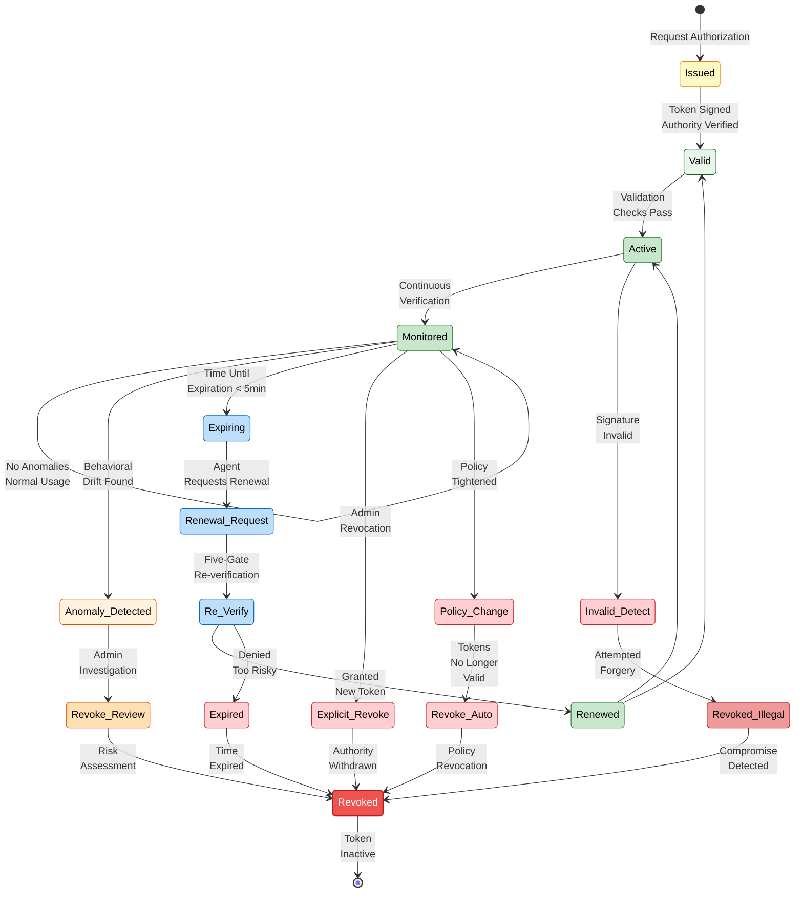

# Figure 7: Authority Token Lifecycle

## Description
Complete lifecycle of cryptographic authority tokens from issuance through expiration or revocation.

## Lifecycle Diagram (Mermaid)



## Token Structure

### Complete Token Object

```json
{
  "version": "1.0",
  "type": "authority_token",
  
  "token_id": "auth_550e8400_e29b_41d4_a716_446655440000",
  "issuer_id": "authority_brain_instance_7",
  "issuer_timestamp": "2025-07-22T14:30:00Z",
  
  "subject": {
    "agent_id": "agent_diagnostic_001",
    "agent_name": "Diagnostic Analysis Agent",
    "agent_type": "diagnostic"
  },
  
  "authorization": {
    "action_scope": [
      "read:patient_history",
      "read:test_results",
      "read:medical_records",
      "recommend:diagnosis"
    ],
    "resource_scope": [
      "org:healthcare_network_alpha",
      "database:patient_records"
    ],
    "operation_limit": 100,
    "operation_count": 0
  },
  
  "temporal": {
    "issued_at": "2025-07-22T14:30:00Z",
    "valid_from": "2025-07-22T14:30:00Z",
    "valid_until": "2025-07-22T15:30:00Z",
    "time_to_expiry_seconds": 3600
  },
  
  "conditions": {
    "require_mfa": false,
    "source_ip_whitelist": ["10.0.1.0/24"],
    "max_requests_per_minute": 60,
    "max_request_size_bytes": 10485760,
    "require_https": true,
    "geo_restriction": "within_country",
    "device_fingerprint_match": true
  },
  
  "revocation": {
    "revocation_triggers": [
      "admin_explicit_revoke",
      "anomaly_score_exceeds_0.7",
      "policy_violation_detected",
      "token_expiry",
      "schedule_based"
    ],
    "revocation_status": "valid",
    "revocation_reason": null,
    "revocation_timestamp": null
  },
  
  "cryptography": {
    "algorithm": "EdDSA",
    "key_id": "key_abc123_current",
    "signature": "3045022100de78a6...",
    "verification_path": "https://auth.iriskey.io/verify/key/key_abc123_current"
  },
  
  "audit": {
    "issued_by_gate_decisions": [true, true, true, true, true],
    "audit_trail_entry_id": "audit_entry_xyz_789",
    "parent_request_id": "req_client_12345"
  }
}
```

---

## Phase 1: Issuance

### Trigger
- Agent requests authorization for action
- Or: Scheduled token renewal

### Process
1. **Identify requestor:** Who is requesting authorization?
2. **Evaluate authority:** Pass through Five Gates
3. **Generate token:** Create token object with claims
4. **Sign token:** Authority Brain signs token with private key
5. **Return token:** Send token to agent

### Five-Gate Verification (Part of Issuance)
```
Gate 1: Identity  → Verify agent is authentic
Gate 2: Policy    → Verify policy permits action
Gate 3: Action    → Verify action within scope
Gate 4: Context   → Analyze request context for anomalies
Gate 5: Execution → Verify systems ready to proceed

All gates must pass for token to be issued.
If any gate fails → Token request denied; agent receives rejection reason.
```

### Output
- **If approved:** Token with cryptographic signature
- **If rejected:** Rejection reason; can retry later

### Latency
- ~150–800 ms (depends on anomaly detection time)

---

## Phase 2: Validation

### When Validation Occurs
- Agent uses token for action request
- Every time agent attempts to use token

### Validation Process
1. **Extract token** from request
2. **Verify signature:** Authentic issuance? (did Authority Brain sign this?)
3. **Check claims:** 
   - Issuer ID matches (was this signed by a trusted Authority Brain?)
   - Signature algorithm recognized
   - Key ID current (not rotated away)
4. **Verify temporal bounds:**
   - Current time ≥ valid_from? (not too early)
   - Current time ≤ valid_until? (not expired)
5. **Check revocation status:** Is token on revocation list?
6. **Validate conditions:** All conditions pass? (IP whitelist, MFA, rate limits, etc.)

### Decision
- **Valid:** Token passes all checks; proceed with action
- **Invalid:** Token fails any check; reject action
  - Return specific reason (expired, revoked, signature invalid, condition failed)

### Latency
- ~10–100 µs (cached revocation list; mostly local)

---

## Phase 3: Active Use

### Normal Operation
- Token is **Valid** and **Active**
- Agent uses token for authorized actions
- Each action:
  1. Validates token (above)
  2. Executes action (if token valid)
  3. Logs action to audit trail

### Continuous Monitoring (Background)
- Monitoring system continuously tracks agent behavior
- For each action:
  - Record action details
  - Update behavioral profile
  - Calculate anomaly score
  - Check for drift or violations

### Monitoring Outputs
- **Normal:** No issues; operation continues
- **Low Anomaly (0–0.3):** Unusual but acceptable; monitor closely
- **Medium Anomaly (0.3–0.7):** Significant deviation; escalate or restrict
- **High Anomaly (0.7–1.0):** Likely compromise; revoke token

### Token Consumption
- Some tokens have operation limits (e.g., "valid for 100 requests")
- Each use decrements operation_count
- When operation_count reaches limit, token expires (can request renewal)

---

## Phase 4: Renewal

### When Renewal Needed
- Original token expiring (e.g., 1-hour lifetime; now at 55 minutes)
- Agent needs to continue operating beyond token lifetime

### Renewal Process
1. **Agent identifies:** Token expiring soon
2. **Agent requests:** New token with same or similar scopes
3. **Authority Brain re-evaluates:** Full Five-Gate verification
   - May grant renewal (conditions unchanged)
   - May deny renewal (behavior has changed; policy tightened; risk increased)
   - May grant with restrictions (scopes reduced; conditions added)
4. **New token issued:** Fresh token; new expiration time; new signature

### Key Point: Renewal is NOT Automatic
- Even though previous token was valid, renewal may be denied
- Renewal is an opportunity to re-verify authorization
- If agent behavior has changed, renewal can be denied

### Example Renewal Scenarios

**Scenario 1: Normal Renewal**
```
Agent: Diagnostic Agent
Previous token expiring in 5 minutes
Renewal request: "Renew for another hour"

Five-Gate re-verification:
  Gate 1: Agent identity still valid ✓
  Gate 2: Policy still permits ✓
  Gate 3: Action scope unchanged ✓
  Gate 4: Behavior normal (no anomalies) ✓
  Gate 5: Systems ready ✓

Decision: APPROVE renewal
New token issued; valid for 1 hour
```

**Scenario 2: Renewal with Restrictions**
```
Agent: Financial Agent
Previous token expiring in 5 minutes
Renewal request: "Renew for transaction approvals"

Five-Gate re-verification:
  Gate 1: Agent identity valid ✓
  Gate 2: Policy permits ✓
  Gate 3: Action scope OK ✓
  Gate 4: Unusual pattern detected ⚠️
         (request rate 2x normal; new merchant accessed)
  Gate 5: Systems ready ✓

Decision: APPROVE with RESTRICTIONS
New token issued with:
  - Reduced max_requests_per_minute (from 60 to 30)
  - Merchant whitelist added (only approved merchants)
  - Valid for 30 minutes (shorter duration; requires re-verification soon)
```

**Scenario 3: Renewal Denied**
```
Agent: Data Export Agent
Previous token expiring in 5 minutes
Renewal request: "Renew for bulk export"

Five-Gate re-verification:
  Gate 1: Agent identity valid ✓
  Gate 2: Policy permits ✓
  Gate 3: Action scope OK ✓
  Gate 4: HIGH ANOMALY DETECTED ✗
         (3 export attempts in 10 minutes; 1000x normal volume)
  (Gate 5 not reached due to Gate 4 failure)

Decision: DENY renewal
Reason: "Anomaly detected; possible compromise; escalate to admin"
Agent receives: Denial reason; access terminated until admin review
```

---

## Phase 5: Revocation

### Revocation Triggers

#### 1. **Schedule-Based Expiry** (Gradual)
- Token has fixed expiration time
- As expiration approaches: agent notified
- At expiration: token automatically becomes invalid
- Latency: Proactive (before expiry time)

#### 2. **Anomaly-Detected Revocation** (Automatic)
- Continuous monitoring detects high-risk behavior
- Anomaly score exceeds threshold (0.7+)
- Decision: Revoke token immediately
- Process: Token added to revocation list; all Authority Brain instances updated
- Latency: <1 second

#### 3. **Policy Change Revocation** (Reactive)
- Organization updates security policy
- Policy change affects active tokens
- Decision: Revoke tokens that no longer comply
- Process: Affected tokens identified; revocation list updated
- Latency: Minutes (proactive notification to agents)

#### 4. **Administrative Revocation** (Manual)
- Security team decides: "Revoke this agent"
- Trigger: Suspected compromise, incident, investigation, termination
- Process: Admin issues revocation command
- Latency: <100ms (immediate)

#### 5. **Violation-Detected Revocation** (Real-Time)
- Token used to attempt unauthorized action
- Gate verification catches violation
- Decision: Revoke token; escalate
- Latency: <100ms (at time of violation attempt)

### Revocation Process

1. **Decision Point:** Trigger evaluated; revocation decided
2. **Add to Revocation List:** Token ID added to centralized revocation list
3. **Distribute:** Revocation list pushed to all Authority Brain instances
4. **Invalidate:** All future validations of revoked token = invalid
5. **Interrupt Operations:** In-flight operations using token interrupted (see next section)
6. **Audit:** Revocation event logged with reason and timestamp

### Revocation List

```json
{
  "revocation_list_version": "2025-07-22T14:45:00Z",
  "revocation_list_id": "rl_xyz_789",
  "entries": [
    {
      "token_id": "auth_550e8400_e29b_41d4_a716_446655440000",
      "revoked_at": "2025-07-22T14:40:00Z",
      "revocation_reason": "policy_violation_detected",
      "revoked_by": "authority_brain_instance_7"
    },
    {
      "token_id": "auth_abc123_def456",
      "revoked_at": "2025-07-22T14:42:00Z",
      "revocation_reason": "admin_explicit_revoke",
      "revoked_by": "admin_user_john_smith"
    },
    // ... more entries
  ],
  "signature": "..."  // Revocation list itself is signed
}
```

### Distributed Consistency

**Hybrid Approach:**
- **Short-lived tokens (1 hour):** Expiry handles eventual revocation
- **Explicit revocation list:** Centralized; distributed to all instances
- **Caching strategy:**
  - Revocation list cached locally (updated every minute or on-demand)
  - Even if cache briefly stale, token lifetime ensures old tokens don't work forever
  - Critical revocations (compromise) pushed immediately

---

## Phase 6: Post-Revocation

### After Token Revoked

**Token Status:** REVOKED (immutable; permanent)

**Future Validation Attempts:**
```
Agent tries to use revoked token
→ Authority Brain checks revocation list
→ Token found in revocation list
→ Validation returns: REVOKED
→ Action rejected
→ Audit trail: "Attempted use of revoked token"
```

**Agent's Recourse:**
- Request new token authorization
- Goes through full Five-Gate verification
- May be denied if risk is high
- May be approved with restrictions

**In-Flight Operations:**
If agent was using token when it was revoked:
- Agent notified: "Your authorization has been revoked"
- Action in progress: Stopped (operation aborted if possible)
- Results of operation: Discarded (not applied to system)
- Audit: Shows revocation point and impact

### Example: In-Flight Revocation

```
T0: Agent starts database transaction with token_A
    Agent executes: UPDATE customers SET status = 'premium'
    WHERE customer_id = 123456
    
T0+200ms: Authority Brain detects anomaly
          Revokes token_A immediately
          Revocation notice sent to agent
    
T0+400ms: Agent receives revocation notice
          Agent still inside database transaction
          Agent calls ROLLBACK (undo changes)
          Transaction rolled back; no changes applied
    
T0+500ms: Audit trail entry:
          "Transaction rolled back due to token revocation
           (anomaly_detected); no data modified"
```

---

## Decision Tree: Token Validation

```
Action Request with Token
    ↓
Is token present? 
    NO → REJECT "Missing authorization token"
    YES ↓
    
Is signature valid?
    NO → REJECT "Invalid signature; possible forgery"
    YES ↓
    
Is issuer trusted?
    NO → REJECT "Issued by untrusted authority"
    YES ↓
    
Is token expired (valid_until < now)?
    YES → REJECT "Token expired"
    NO ↓
    
Is token too early (valid_from > now)?
    YES → REJECT "Token not yet valid"
    NO ↓
    
Is token in revocation list?
    YES → REJECT "Token revoked"
    NO ↓
    
Are all conditions met?
    (IP whitelist, MFA, rate limits, device, geo, etc.)
    NO → REJECT "Conditions not met: [specific reason]"
    YES ↓
    
Do scopes match request?
    (Action scope + resource scope)
    NO → REJECT "Scope mismatch; action not authorized"
    YES ↓
    
✅ APPROVE
   Token is valid; proceed with action
   Log action with token ID to audit trail
```

---

## Performance & Scalability

### Token Lifecycle Latencies

| Phase | Operation | Typical Latency |
|-------|-----------|---|
| **Issuance** | Five-Gate + Token creation | 150–800 ms |
| **Validation** | Signature check + revocation list query | 10–100 µs |
| **Renewal** | Five-Gate re-verification | 150–800 ms |
| **Revocation** | Add to list + propagate | <100 ms for admin; <1 sec for anomaly |

### Scaling Considerations

**At Scale (1000s of agents, 100,000s of tokens):**
- Revocation list caching critical (avoid central bottleneck)
- Token validation must be fast (microseconds, not milliseconds)
- Renewal can be batched (agents often renew simultaneously)
- Anomaly detection can be asynchronous (doesn't block action)

---

## Caption

**Figure 7: Authority Token Lifecycle.** Complete token lifecycle from issuance (Five-Gate verification) through validation (signature + revocation check), active use (with continuous monitoring), renewal (re-verification), and revocation (explicit or automatic). Token moves between states (Issued → Valid → Active → Monitored → Revoked) based on time passage, policy changes, anomalies, or explicit admin action. All transitions logged to cryptographically signed audit trail.
